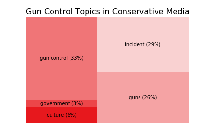
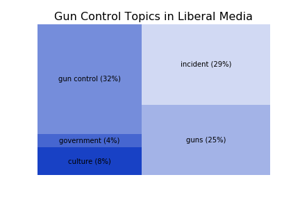
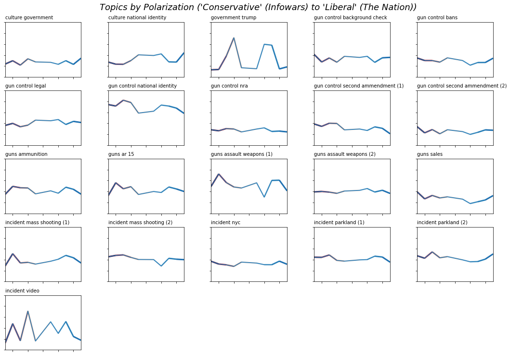
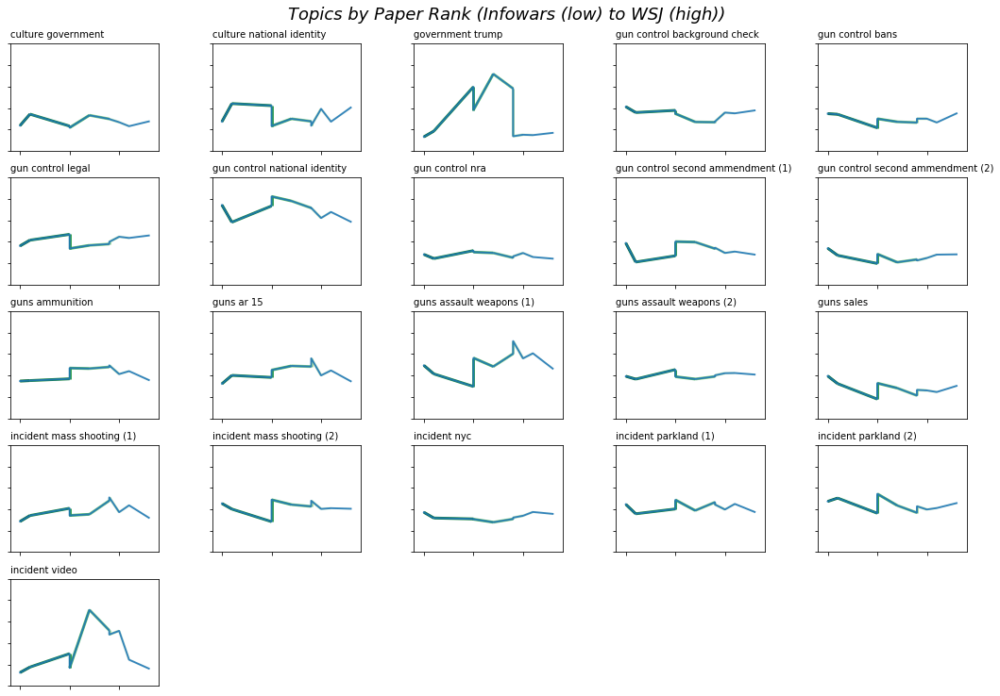
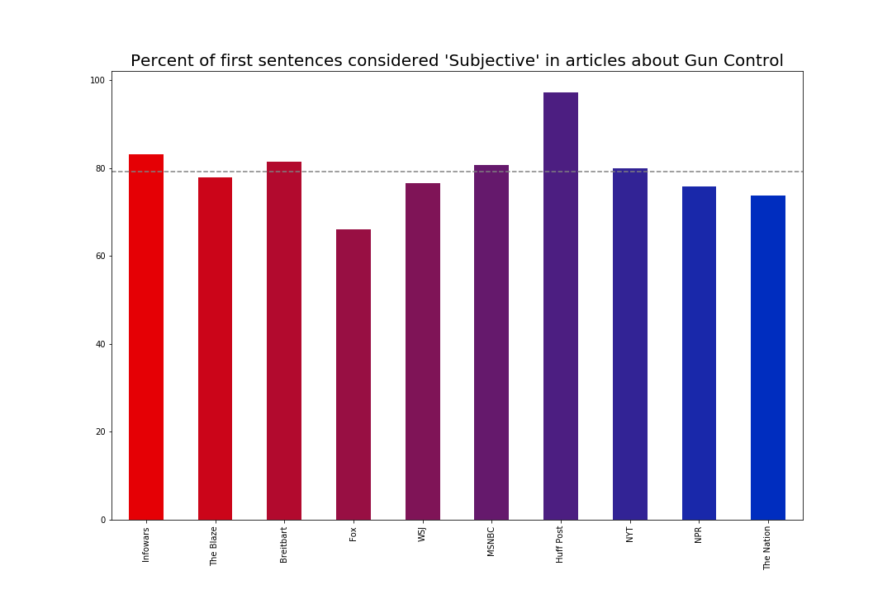
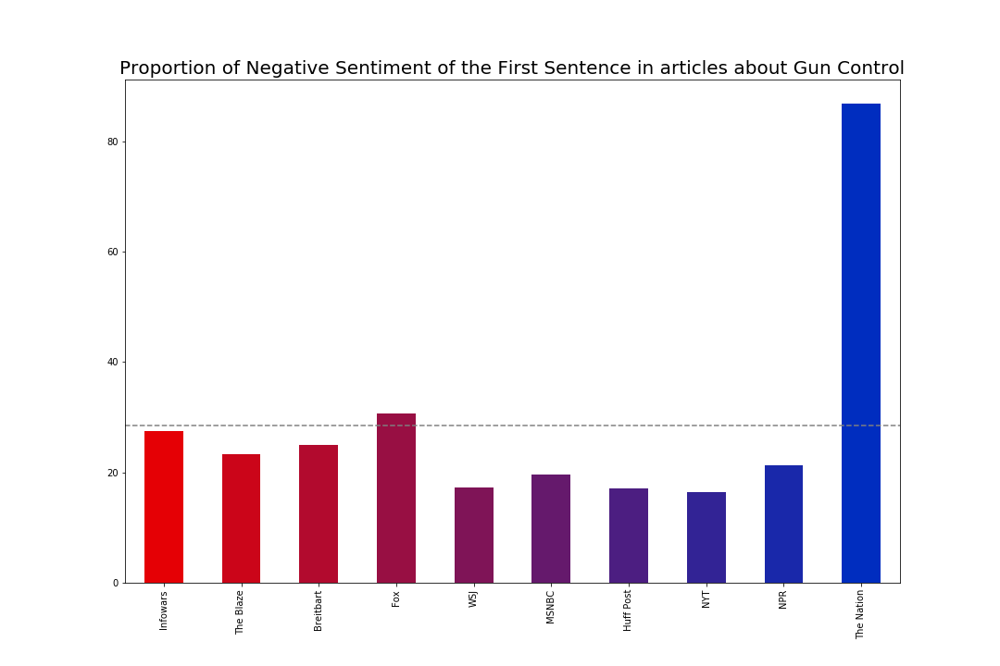
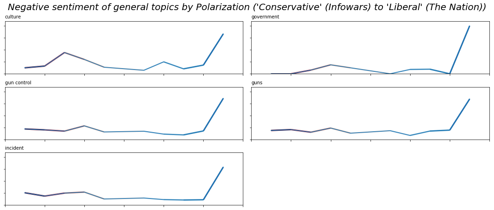
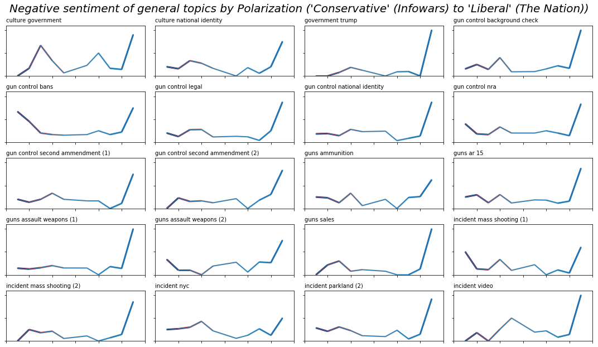

# Politically Polarizing Media Coverage: Topic Modeling and Sentiment Analysis of the Gun Control and Immigration Debates

[Michelle A. McSweeney](michelleamcsweeney.com),
Associate Research Scholar

[The Center for Spatial Research](http://c4sr.columbia.edu/), Columbia University

August 2018

> *Liberal and conservative outlets have different ways of framing the relationship between gun control, culture, and national identity. For conservative outlets, this topic centers around laws, owners, crime, violence, and "America" whereas for liberal ones, it centers around taking action, supporting issues, policies, signing, and "the nation".*

## A Polarized Landscape 

The United States is going through a period of political polarization that is unprecedented in recent history. This phenomenon has been steadily increasing over the past twenty-five years, and is not limited to our elections, but can can be seen on [college campuses](https://www.washingtonpost.com/news/rampage/wp/2017/05/02/political-polarization-among-college-freshmen-is-at-a-record-high-as-is-the-share-identifying-as-far-left/?utm_term=.ec991372a6de), in the [workplace](https://hbr.org/2017/05/research-political-polarization-is-changing-how-americans-work-and-shop), and in the [media we consume](http://www.journalism.org/2014/10/21/political-polarization-media-habits/). In many ways, this is a self-fueling effect: the more polarized our opinions become, the more we produce and consume media that align with our own ideologies, unwilling or unable to see or understand the other side without our own implicit or explicit biases.
 
Given this state, and the overwhelming amount of content produced every day, I wanted a way to compare media that is consumed by people at both ends of the political spectrum. Understanding that I would bring my own implicit biases to any actual reading, this project seeks to distill the articles into topics and narrative styles that can, [from a distance](https://www.nytimes.com/2011/06/26/books/review/the-mechanic-muse-what-is-distant-reading.html), be compared and understood. It is my hope that this will make it possible to see both the most contentious points as well as the areas of agreement and shared values.

For this initial exploration, I focused on the debate around gun control. The project started in the days after the Parkland shooting, and includes articles going back to Sandy Hook. The results show that across the political spectrum, people care about many of the same things: mass shootings, gun control, the second ammendment, etc. The findings offer insight into why and how the political poles are talking past each other even when talking about the same thing.

---

## Methods

To collect the data for this project, I identified 10 representative media outlets drawn from a combination of this 2014 [Pew Study](http://www.journalism.org/2014/10/21/political-polarization-media-habits/) of the political polarization of American media, and this 2017 [Medium post](https://medium.com/@jeffjarvis/a-proposal-to-start-a-responsible-reliable-reasonable-conservative-news-organization-b0dfb60312c7) by CUNY Journalism Professor, Jeff Jarvis. There were not enough conservative media outlets to choose from in the Pew Study, and conservative media has started to expand since the Pew Study was conducted, so the Jarvis article was referenced. Infowars and the Nation were both choosen because they were referenced in that article. The Pew Study is concerned with what media people consumes and how participants rated the trustworthiness of each outlet. They asked about personal political affiliation and what media they consumed for political and current events.  Therefore, this is a study of how the people who consume the media identify rather than the political position of the source itself. 

The media outlets are:

Liberal:
NPR, New York Times, MSNBC, Huffington Post, and the Nation

Conservative:
Wall Street Journal, Fox News, Breitbart, the Blaze, and Infowars[1]

Furthermore, it should be noted that conservative-identified respondents rely on Fox News more than any other source whereas liberal-identified respondents reported drawing on multiple different outlets. This may introduce some bias with respect to how influential each outlet is for different groups. However, in an attempt to capture the polarization of the conversation, the influence each outlet contributes to the total is unweighted.

The outlets were ranked based on degree of polarity, degree or trust, and a composite ranking. For polarization, a 5 is very polarized because they are consumed by "consistent conservatives" or "consistent liberals" and a 1 is consumed by people who identify as more central. The degree of trust was similarly ranked, where 5 is more trusted than distrusted and -5 is more distrusted than trusted. 

Finally, I calculated an overall rating by subtracting the polarity from the trust. Using this metric, the Wall Street Journal has the highest rank (it is the least polar and most trusted by the widest range of people) followed by NPR because they are widely trusted and are read by more central audiences - they are more trustworthy than polarizing. InfoWars has the lowest score followed by the Nation because they are both read by highly polarized audiences though they are not widely trusted even by some people who identify with their polar skew.

The Blaze and New York Times (NYT) are similarly ranked, even though the Blaze is read by more polarized readers than the NYT. Their ranking is in part because consistently conservative readers trust the Blaze and distrust the NYT whereas the opposite is true for consistently liberal readers. The result is that the mid-range media sources are the Blaze, NYT, and Fox News.  

| Outlet	| Trust  | Polarity  | Rank |
|:---------:|:------:|:---------:|:----:|
| WSJ	    | 4	     | 1	     | 3    |
| NPR		| 5	 	 | 4		 | 1    |
| MSNBC		| 1		 | 1		 | 0    |
| Blaze		| 3		 | 4		 | -1   |
| NYT		| 2		 | 3		 | -1   |
| Fox		| -1	 | 2		 | -3   | 
| Breitbart	| -2	 | 3		 | -5   |
| huffPo	| -3	 | 2		 | -5   |
| Nation	| -4	 | 5		 | -9   |
| InfoWars	| -5	 | 5		 | -10  |

While this ranking has its own significant bias in it, it offers a useful way to rank the combination of how much each outlet it trusted across a polarized audience. This is not to say that any outlet **should** have any particular ranking, only that within this ecosystem, this is what the composite trust/polarity 

[1] While this article seeks to understand political polarization in the media, I do not intend to validate lies or misinformation that some outlets choose to print. 

### Collecting the Corpus

Once the outlets were identified, I made Google [Custom Search Engines (CSE)](https://cse.google.com/cse/all) for each source so I could get lists of article links for each source. I then made a list of keywords related to gun control. I looped through this list on each CSE to get a list of article links (omitting duplicates).

The Gun Control Keywords are: gun, firearm, AR15, AR-15, weapon, shot, shoot, rifle, bump stock. Since these were used in the CSE, it collected any article that mentioned one of these words. As a result, there were articles about flu shots, weapons in North Korea, Syria, and Turkey, and similar topics were not related to gun control in the US. Since this is a rather short and finite range of other topics, any article about the flu or geopolitics was removed with list comparisons.

I then gathered the Title, Author, Date, and article content from each article using a combination of Beautiful Soup and Newspaper packages in Python.

### Topic Modeling

Once the corpus was collected, I transformed each article into a word vector that could be quantitatively analyzed. The first step was to remove the stop words. Stop words are functional words that are semantically opaque (though often syntactically essential), such as prepositions, auxiliaries, articles, etc. For example, if I want to tell you that "the house is burning", you would know what I meant if I just said "house burning". Stop words don't contribute semantically, they make our algorithms run slower, and can inhibit topic identification by appearing too frequently in the word counts. 

After removing the stop words, there is still some cleaning to do to transform the sentences in our articles into a "bag of words" that can be analyzed computationally. First, I normalized the words by transforming them into lower case and removing punctuation. Then I lemmatized the words, transforming them into the appropriate roots (removing the grammatical affixes and finding dictionary forms). These steps are essential to minimize redundancy and maximize efficiency by ensuring that each word is content-ful and unique. 

Finally, we, as humans, excel at understanding sentences and finding meaning amidst language, computers are better at statistics. So, topic modelling relies on the semantic content of the words, and nothing else. From here, I had to make a decision if I was going to use Non-Matrix Factorization (NMF) or Latent Dirichlet Allocation (LDA) because it affects the next step. LDA is a statistical model that utilizes a count vectorizer whereas NMF utilizes tf-idf - explained below. I ended up doing it both ways and picked NMF because the topics were more easily interpretable and quantifiable. 

I then transformed the list of words in each article into a series of vectors representing the article in relationship to the corpus. For example, let's say we have three articles. The first is about "the second amendment and the right to bear arms." The second is about "gun control and concealed carry laws." The third is about "the guns used in the Parkland shooting." For the purposes of demonstration, pretend that those are the only words in each article. If we remove the stop words, normalize our words, and lemmatize them, our three articles now look like this:

1. second amendment right bear arm

2. gun control conceal carry law

3. gun use parkland shoot

Across our entire corpus, we have 13 unique words. We can transform each article into a vector, and the corpus into a matrix by assigning a 0 or 1 if the word appears or not. 

second, amendment, right, bear, arm, gun, control, conceal, carry, law, use, parkland, shoot

1. [1,1,1,1,1,0,0,0,0,0,0,0,0]

2. [0,0,0,0,0,1,1,1,1,1,0,0,0]

3. [0,0,0,0,0,1,0,0,0,0,1,1,1]

However, this too is a simplification. The bag of words statistic is actually created through a scoring metric called term frequency-inverse document frequency (tf-idf). Tf-idf is a non-binary statistic that represents the importance of a given word to the meaning of the article. This number increases every time a word appears in the article relative to the corpus. So, if a word is very common in the corpus, its value in a tf-idf is low, whereas if a word appears many times in one article, but infrequently across the corpus, its value will be high. 

The sci-kit learn package for Python has a function to perform this, called tfidfvectorizer. I used this, and set the parameters to max_df = 0.9, min_df = 0.1, and removed the stop words. The min and max df here refer to how the vocabulary is built. For the max_df, the closer a term frequency is to 0, the more likely that a word is common. In this corpus, a word like "gun" likely has a term frequency very close to 0. In a study of gun control, the word "gun" doesn't tell us very much about the article topic because it likely appears in all of the articles. Therefore, I omitted anything with a term frequency less than 0.1. Likewise, any word that is very rare likely doesn't tell us much either. Even when an article is about a very specific topic, that word is likely to appear multiple times. Such a word may be a quirk of the author's style or a typo. Therefore, I omitted anything with a term frequency greater than 0.9.

This matrix forms the basis of the Non-negative Matrix Factorization method of topic modelling. The values from the tf-idf are transformed to produce topics. 

### Identifying topics

After some tinkering, I chose 24 topics with 2 words and then 10 words each. After 24, the topics started to be uninterpretable, and with fewer than 10 words, it's difficult to determine exactly what the topic was about. I then interpreted each topic based on my own understanding of the events and the discourse around gun control, I grouped them into broad categories and more narrow ones. The broad categories are: culture, incidents, government, guns (as objects), and gun control, which managed to capture all of the categories with little overlap.
 
Without human interpretation, these topics are meaningless, but this is also one junction where bias is often introduced. I then categorized each topic into a general category for analysis. For example, I classified Topic 0 as an 'incident', specifically, 'Parkland'. The 2 word version of Topic 0 is [shooting, mass], which tells us it was a mass shooting, but not which one. The 10 word version is [shooting, mass, people, florida, parkland, left, dead, two, victim, shooter], which tells us that this topic refers to the mass shooting in Parkland Florida. Some words are still so general that they are not helpful in figuring out what the topic is (i.e., 'people', 'left'), and these words probably could be removed with the stop words, but they also don't detract from the meaning, so I left them.  The results are in the table below.

| Topic |	ten words                     | words2        | general      | specific        |
|:-----:|:-------------------------------:|:-------------:|:------------:|:---------------:|
| 0	    | shooting mass people florida parkland left dead two victim shooter            | shooting mass | incident	   | parkland        |
| 1	    | officer police department incident county city say video enforcement call	    | officer police| incident 	   | police shooting |
| 2	    | ar 15 semi used store buy automatic rifle ammunition gun	                    | ar 15	        | guns	       | ar 15           |
| 3	    | school student high parkland florida medium child control week national	    | school student| incident	   | parkland        |
| 4	    | trump president white house read morning republican wednesday lawmaker support| trump president| government  | trump           |
| 5	    | nation action sign take support issue three policy program matter	            | nation action	| culture	   | national identity|
| 6	    | say one like people think know would may could time	                        | say one	    | meta	       | opinions        |
| 7	    | gun control violence law owner show crime america say debate	                | gun control	| gun control  | national identity|
| 8	    | get news whether already sign read told life let follow	                    | get news	    | meta	       | meta            |
| 9	    | ban assault magazine weapon bill ammunition high bullet would president	    | ban assault	| gun control  | bans            |
| 10	| video street 000 country want people show world earlier across	            | video street	| incident	   | video           |
| 11	| state law carry bill legislation republican would measure lawmaker enforcement| state law	    |gun control   | legal           |
| 12	| firearm ammunition federal act gun sale use report crime owner	            | firearm ammunition| guns	   | ammunition      |
| 13	| com second amendment twitter news follow armed bullet medium host	            | com second	| gun control  | second amendment|
| 14	| rifle automatic military round semi assault fire style magazine long	        | rifle automatic| guns	       | assault weapons |
| 15	| said told county home authority official year two old according	            | said told	    | meta	       | meta            |
| 16	| new york city year morning old time law week first	                        | new york	    | incident	   | shooting        |
| 17	| background check sale system purchase gun record buy federal criminal	        | background check|	gun control| background check|
| 18	| court federal case right law family arm amendment second state	            | court federal | gun control  | second ammendment|
| 19	| nra national association member group republican right president political amendment|	nra national| gun control| nra           |
| 20	| weapon read 2016 use used system military assault report made	                | weapon read   | guns	       | assault weapons |
| 21	| company sale store year make group million end asked said	                    | company sale 	| guns	       | sales           |
| 22	| attack american government left report military official used member including| attack american| culture     | government      |
| 23	| shot man killed read year police old morning two 2016	                        | shot man	    | incident	   | mass shooting   |

### Sentiment Analysis 

I analyzed the sentiment of the first sentence of each article using [TextBlob's](http://textblob.readthedocs.io/en/dev/index.html) built-in, pre-trained [Sentiment Analyzer](http://textblob.readthedocs.io/en/dev/api_reference.html#module-textblob.en.sentiments). This classifier was trained on [movie reviews](http://ai.stanford.edu/~amaas/data/sentiment/) and uses Naive Bayes classification. I was using a pre-trained classifier because in our current political climate, I felt it would be nearly impossible to efficiently classify articles about politically polarized topics without reifying the implicit bias I am attempting to address. Furthermore, I am biased. I know this about myself, and I also know that the majority of people I have contact with are biased in the same or opposite way. So I used a classifier that had already been trained for less politically charged content. 
Movie reviews have some advantages as well. First, if we take a movie to be a story and the way a story is told, then a movie review is primed to recount that story, describing what has happened, and using language that expresses the reviewer's opinion. Secondly, it is a relatively long format, similar to coverage of an event or national interest topics. 

To perform this analysis, I selected first sentence of each article because according to a 2014 study by the [American Press Institute](https://www.americanpressinstitute.org/publications/reports/survey-research/how-americans-get-news/) (and various studies done by private sector data scientists), fewer than half of Americans read any story past the headlines and the lede (the first sentence). Though some people do continue to read the entire article, the main point must be made within the first sentence: hooking the audience or not. Secondly, sentence-level classification tends to be more reliable than 500-1,000 word classifications. 

I then dropped the scores that had lower than 65% reliability in one way or another. When TextBlob classifies the results, it also offers a reliability score. Both polarity and subjectivity scores are returned with this method. The subjectivity values are within the range [-1.0, 1.0], where 0.0 is very objective and 1.0 (as an absolute value) is very subjective. Positive and negative scores were reported only if the subjectivity was greater than 0.65 (absolute value). I reported on the negative polarity scores rather than positive for consistency, though the positive is just the inverse of the negative in all relevant cases. 

---

## Analysis 

### Topic Modeling

After returning and interpreting the topics, I calculated what percentage of each general topic dominated each type of outlet, and what specific topics were the most explored by each media source. I further looked at what specific topics were the most polarizing by organizing the topics from liberal to conservative, and investigated the coverage of both specific topics and general topics based on the trust/polarization score of each outlet. 

### Sentiment Analysis

There were three main ways I looked at the results of the sentiment analysis: by media source, political affiliation, and topic. By media source, I analyzed the ratio of articles with negative lede sentiment as well as the ratio of neutral (objective) to highly subjective. I then calculated the degree of negativity for each topic by the outlet and then compiled those results to show the degree of negativity by topic by political polarization.

---

## Results

### Topic Modeling

Overall, there was very little difference in coverage of each general topic by Conservative versus Liberal media outlets. The treemaps below illustrate the small differences. 

If instead we look at each topic along the degree of polarity, some interesting patterns emerge. Each of these graphs shows the prominence of the topic in each media outlet - ranked from those with a "consistently Conservative" readership to "consistently Liberal" (again, topics consisting of metadata or positional language (believe, said, etc.) were omitted. The order of outlets is:

**Infowars, the Blaze, Breitbart, Fox, WSJ, MSNBC, Huffington Post, NYT, NPR, the Nation**

For the most part, the topics are relatively consistently covered by outlets across the political spectrum, though two topics stand out: Trump and videos. The first is the topic about Trump and his responses to the gun control debate and incidents of violence. We already know that Trump is polarizing as a topic, but it also seems that some outlets cover him with relationship to gun control more than others. Interestingly, those outlets are neither all liberal nor all conservative. 

The second topic is the one about video cameras. At first, I thought this was about body cameras, but it is actually related to reporting on video footage from protests and other events. For example, many of the articles that contributed to this topic were about the Chalottesville "Unite the Right" protest in August 2017, where many self-identified white nationalists chose to carry guns, and there was significant reporting on the video footage that counter-protesters and others captured. What is interesting about this topic is how erratic it seems when viewed along a political continuum. This is confirmed by looking at the standard deviation of the prevalence of all of the topics: Trump, videos, and gun control as related to the national identity stand out against all the others. 

Some topics that we might have expected to appear differently in each media outlet do: the topic relating gun control and national identity is covered more broadly by conservative outlets than liberal ones (though as noted above, the difference in reporting is large across outlets), and the topic about culture and national identity shows the opposite trend. 

If we look at this same data organized instead by ranking (a composite of degree of polarization and degree of trust). Both of these topics (Trump and video coverage) are almost ignored by the outlets that are low polarization/high trust and high polarization/low trust, but were very widely covered by the outlets ranked in the middle. 

The gun control and national identity topic seems relatively consistent across rankings, but a new topic appears: one of the assault weapons topics is more prominent in the higer ranked outlets (low polarity/ high trust). This is the topic that discusses rifles extensively (rifle automatic military round semi assault fire style magazine long), explaining the relationship between "military-style assault rifles" and "semi-automatic rifles". The other version of this topic, which is consistent across media outlets focuses more on the weapons aspect of these types of guns. 

If we look at the topics in terms of standard deviation to again identify those topics that are covered the most/least by different outlets, the same topics appear:

* Trump
* Gun control and the national identity
* Coverage of videos shared on social media

While these three topics do not seem to be, in and of themselves, able to account for the political polarization, they do seem to be adding to the ways in which the discussion diverges among self-selected groups. That is, some outlets cover these topics extensively, while others nearly avoid them - at least to a greater degree than other topics in the corpus. 

#### Sentiment Analysis

Before looking at sentiment, we first look at the degree of subjectivity. Our classifier returned a subjectivity value ranging from 0.0 to 1.0 (very subjective). I classified articles with a rating of at least 0.65 as "subjective". The proportion of subjective articles to total number of articles in the corpus for each media outlet is shown in the table below. 

We see that Fox News is actually far below the average, and Huffington Post is far above it. This may come as a surprise if we think that objectivity and trustworthiness are related. Even though Fox News is trusted by people who report that they are "consistently conservative" and is the most widely consumed news media outlet among conservatives, it is not the most trusted by all parties: The Wall Street Journal is the only paper that was considered trustworthy by people across the political spectrum. Given this, if we consider objectivity to be a mark of trustworthiness, then we would expect the Wall Street Journal to be the lowest. But, in fact, the WSJ is only slightly below average, about the same as NPR. Huffington Post on the other hand, is classified as highly subjective in their first sentences, though they are not the most politically polarized, they are also in the second lowest group for trust (above The Nation and Infowars, about the same as Breitbart). 

If we look now at how negative those first sentences are, we see a much different pattern emerge. Rather than being relatively close, there is one outlier: The Nation. 

There are a few ways to think about this. One of which is spin, but another is of political sentiment. This is an analysis only of articles about gun control, not overall coverage, and the Nation is by far the most liberal and progressive of all the outlets highlighted here. It should also come as no surprise that journalists and consumers of the Nation are outraged about the state of American gun policies, and outrage that is reflected in the sentiment analysis of the first sentence of articles about gun control. 

In every single category, the Nation had a disproportionate ratio of articles with negative sentiment. However, where they truly stand out is with the government topic generally. On all topics related to the government, 100% started with negative sentiment. No other paper has a perfect score on any of the topics. On the more specific topics, 100% of articles about Trump, background checks, sales, and assault weapons were rated as having negative sentiment. The topics that had the lowest ratio of negative sentiment were those about incidents (Parkland and New York City). 

If we look at these trends more closely, we see that with the exception of the Nation, there are very few outliers. The set of charts below parallels those above by ordering the papers from most conservative to most liberal and illustrates the percent of negative sentiment by general topic. 

If we look instead at the more specific topics, the pattern stays roughly the same: with the exception of the Nation, there are only a few outliers, and no readily discernable trends. 

Notably, Infowars, the Blaze, MSNBC, and NPR all have 0% negative sentiment in articles about Trump, which may initially be surprising given that per the topic modelling analysis, it seemed that Trump was the most polarizing and hotly discussed topic. But it also seems that across the political spectrum, journalists use less affective language when discussing the president's response to shootings and gun control. 

Additionally, both InfoWars and the Blaze have high proportions of negative sentiment in articles about gun bans: over 50%. Likewise, Breitbart, in addition to having many articles about culture and the government, tends to frame them negatively (67% of those articles are classified as negative sentiment). The Huffington Post does as well (50% of those articles are classified as negative sentiment), though they discuss it less often. 

## Conclusions

Overall, though our country is politically more polarized than ever, the language that we use to indicate that is complex. It's clear that media consumed by both parties is not uniform, and there is considerable difference in the way that gun control is covered. Though this study looked only at topic and sentiment, it offers a distant reading of "news" outlets. Though the truth of statements in the articles was not addressed, since, in our current political moment, the very idea of truth is somehow polarizing. 

And yet, this debate hits at the meaning of the constitution: who it was written for, and what it protects. There are two topics about the second amendment. The first is about the national conversation, following it on twitter and the news, the second is about families, federal and state laws, rights, and taking up arms. Ultimately, these two topics are very different: the first is about the national debate, who we are, and the voice of the people, the second is about the laws that govern the United States, and how those laws are interpreted. Outlets across the political spectrum discuss both of these nearly equally, even if they ascribe different meaning to the answers. 

However, liberal and conservative outlets have measurably different ways of framing the relationship between gun control, culture, and national identity. For conservative outlets, this topic centers around laws, owners, crime, violence, and "America" whereas for liberal ones, it centers around taking action, supporting issues, policies, signing, and "the nation". To this topic, whether we live in "a nation", or "America" says a lot about how we think about gun control (notably, "America" and "American" actually appear slightly more frequently in liberal outlets compared to conservative, but not with respect to topics of national identity).  

Furthermore, topics such as Trump's responses and videos of incidents and protests are unevenly covered: some outlets give them a lot of attention whereas others give them significantly less. This may indicate different coverage styles (i.e., some outlets don't cover these because it doesn't fit into their mission) or it may indicate the polarization *within* each political pole. Further study of coverage of different topics is necessary to better understand if this polarization is specific to gun control or more general. 

Finally, the biggest take away may in fact be that for the most part, most media outlets are discussing many of the same topics with much the same affective tone (with the obvious exception of The Nation, who clearly expresses their negative sentiment at the state of of American gun control and policy). Even though the readership is along an increasingly polarized continuum, every point along that continuum is engaged in this debate. The difference is where we are starting from—basic assumptions about culture and identity, or the relationship between guns and what it means to be an American. 

The code for this project is on [Github](https://github.com/michellejm/guns_in_America). 

